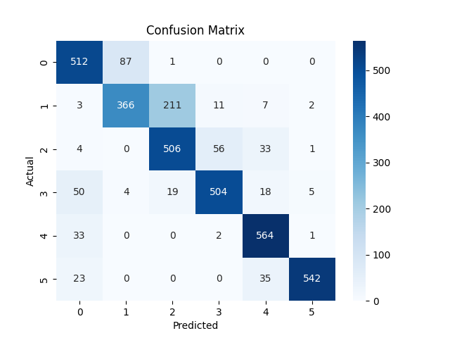

# GestureBind

GestureBind is a powerful and lightweight desktop application designed to bring gesture-based interaction to your computer. Built using Electron, Python, MediaPipe, and Flask, GestureBind offers cross-platform compatibility, high recognition accuracy, and minimal resource usage, making it an efficient tool for innovative input methods.

## Features

- **Gesture Recognition**: Leverages MediaPipe to achieve 83% (v1.0) accuracy in recognizing gestures.
- **Cross-Platform Compatibility**: Works seamlessly across Windows, macOS, and Linux.
- **Low Resource Usage**: Designed for optimal performance, ensuring minimal impact on system resources.
- **Customizable Gestures**: Map gestures to specific actions for personalized interaction.

## Technologies Used

- **Electron**: For creating the desktop application.
- **Python**: Backend logic and integration.
- **MediaPipe**: Gesture recognition and tracking.
- **Flask**: RESTful API for communication between the frontend and backend.

## Testing Results  

To test GestureBind, I used a [Kaggle dataset](https://www.kaggle.com/datasets/koryakinp/fingers) containing a large collection of hand gesture images.  

### Version 1.0  

The confusion matrix for GestureBind v1.0, generated on **March 12, 2025**, is shown below:  


GestureBind v1.0 achieved an **83% accuracy rate**, demonstrating reliable performance across various conditions. However, the confusion matrix indicates that most misclassifications occurred when detecting **single-finger gestures**, which were frequently misinterpreted as two-finger gestures.  

### Future Improvements  

For the next version, I plan to optimize the model to improve **single-finger gesture detection** and enhance overall accuracy.

## Installation

Follow these steps to set up GestureBind on your machine:

### Prerequisites

- Node.js (v14 or later)
- Python (v3.8 or later)
- pip (Python package installer)

### Steps

1. Clone the repository:

   ```bash
   git clone https://github.com/jszama/gesturebind.git
   cd frontend
   ```

2. Install dependencies:

   ```bash
   # Install Electron dependencies
   npm install
   ```

3. Launch the Electron app:

   ```bash
   npm start
   ```

## Usage

1. Launch the application by running the commands above.
2. Follow the on-screen instructions to configure gestures.
3. Map gestures to actions such as opening files or webpages.
4. Save the configuration and enjoy gesture-based control!

Feel free to raise an issue or contact me directly if you have any questions or suggestions.

